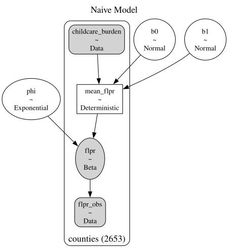

## Introduction {#sec-1}
Earlier this year, I examined the major factors that help explain U.S. maternal labor force participation trends and persistent wage differentials between men and women. Existing research consistently identifies motherhood as an important contributor to both reduced labor-force participation and long-term earnings penalties.

Childcare costs, which have significantly outpaced overall inflation, play a significant role in women’s ability or decision to remain in the workforce. This trend has driven an overall focus within the research community on the relationship between childcare affordability and maternal labor force participation. Research has appropriately paid particular attention to low-income women, for whom childcare expenses represent a large share of potential earnings, and whose labor market attachment is the most impacted by childcare costs (https://www.jstor.org/stable/41238095). 

Several studies have concluded that reducing childcare costs would increase maternal employment, especially among low-income women. The majority of U.S. childcare assistance programs are also primarily available for lower-income households and reach only a minority of eligible families. Less is known about this association amongst women in moderate or high income brackets, who remain burdened by high childcare costs. For these women, childcare constraints may impact labor force participation differently. Increased earning potential and financial resources may make them more likely to remain employed despite high childcare costs, while reducing hours or seeking work flexibility to meet childcare demands. This behavior may ultimately result in reduced career advancement and lower wages. 

This paper tests this theory, using county-level data to analyze how women in different occupational contexts may respond differently to childcare costs. I use the concentration of women working in “greedy” occupations, or high-paying occupations that disproportionately reward long hours and constant availability, to measure local occupational context. This is used to test whether the known association between childcare burden and maternal labor-force participation is moderated by occupation “greediness”.

County-level female labor force participation only determines whether mothers participate in the labor force, rather than how many hours they work. Therefore, this analysis does not directly model the wage gap. However, beginning to understand potential effect heterogeneity in this relationship may help explain persistent gender gaps in earnings despite comparable levels of overall labor-force participation.

## Background and Conceptual Framework

### Existing Childcare Policy and Maternal Employment
Researchers generally agree that increased investment in childcare affordability interventions results in higher maternal labor force participation, particularly among low-income women in the first few years after birth. For instance, Burgess, Chien and Enchautegui find that increasing Child Care and Development Block Grant (CCDBG) expenditures by 10-percent per child would increase employment levels among low-income women with young children by between half to two-thirds of a percent (https://aspe.hhs.gov/sites/default/files/migrated_legacy_files//171051/EffectsCCSubsidiesMaternalLFPBrief.pdf).

Still, the majority of U.S. childcare assistance programs reach only a subset of families and are concentrated among lower-income households. The Child Care and Development Block Grant (CCDBG) is only available for families who make less than 85% of their state median income. Even amongst those that meet requirements, federal childcare subsidies only reach approximately 14% of eligible families (https://aspe.hhs.gov/reports/factsheet-estimates-child-care-eligibility-receipt-fiscal-year-2017), and state subsidies reach only approximately 22% of eligible families. Tax incentives, including the Child and Dependent Care Tax Credit, also benefit a minority of families with children due to its non-refundable structure, steep income phase-downs, and restrictions that require two working parents. (https://www2.census.gov/library/working-papers/2025/adrm/ces/CES-WP-25-25.pdf)

While most childcare programs focus on low-income families, evidence from universal early childcare programs suggests that reducing childcare constraints can affect maternal employment across a broader range of women. Two years after implementing a universal pre-kindergarten program in 2008, D.C. observed a 12% increase in the maternal labor force participation rate. A study from the Center for American Progress found that this increase was strongly associated with implementation of universal preschool (https://www.americanprogress.org/article/effects-universal-preschool-washington-d-c/). This example is particularly important given D.C.’s occupational profile, with an unusually large concentration of highly-educated women in high-paying, senior positions. This example motivates the current analysis, which seeks to understand the varying slope of the relationship between childcare affordability and labor force participation among counties with different female occupational profiles.

### Occupational “Greediness”
This analysis builds on existing research from economist Claudia Goldin, who has extensively studied “greedy occupations”. Goldin finds that greedy occupations lead women to remain employed, even as they have children, but earn less over time, due to childcare responsibilities that prevent them from meeting demanding work requirements, including long hours and travel (Goldin 2014). Women’s role as primary care-givers leads them to take career breaks, reduce hours, and trade high-stress roles for flexible roles. 

Goldin identifies finance, law, consulting, and corporate management as common greedy occupations, characterized by time inflexibility, low work substitutability, and non-linear pay. These occupations drive gender pay differentials, since women are more likely to experience childcare related work interruptions and less likely to be able to work rigid schedules (Sobeck 2024). Using Goldin’s research as a framework, I model county-level occupational greediness by sex using U.S. Census adult employment statistics. 

### Educational Attainment
Educational attainment is closely related to occupation context and labor force participation. Geographies with a greater share of individuals with advanced degrees are more likely to have higher concentrations of individuals in advanced white-collar occupations. Women in these occupations are more likely to have greater earning power, which also influences their labor force attachment. I model educational attainment as the share of individuals in each county with at least a bachelor’s degree. This is used to determine if the effect of greedy occupation structure is partially or completely explained by county educational composition.

### Geographic “Rootedness” and Informal Childcare Support
Informal childcare support, through family-members, friends and neighbors, can provide mothers with relief from exorbitant childcare costs, as well as unmatched flexibility. However, the availability of local support varies across households. Highly-educated and high-income individuals are often more likely to move away from their birthplace, where family resides, to regions with greater economic opportunities for higher-paying jobs. While over half of U.S. adults report living within an hour of family, a Pew Research study found that upper-income adults and adults with a postgraduate degree were the most likely to report living near no extended family. https://www.pewresearch.org/short-reads/2022/05/18/more-than-half-of-americans-live-within-an-hour-of-extended-family/

Existing literature suggests that access to informal familial childcare can influence maternal labor force participation. Compton and Pollak find that married women with young children that live within close proximity of mothers or mothers-in-law are predicted to have a 4 to 10 percent higher labor force participation rate when compared to women that live farther from family (https://www.sciencedirect.com/science/article/pii/S0094119013000314). They theorize that family members within close proximity provide “insurance” to working mothers, by being available to provide care in irregular or unanticipated circumstances. Building upon this framework, I use geographic rootedness as a proxy for access to local familial childcare. I model geographic “rootedness” as the share of adults 25 or older in each county who report living in the state they were born in. While this does not directly estimate the proximity of family or availability of informal childcare, it provides a county-level profile of geographic attachment to measure potential differences in access to informal childcare support.

## Data and Measures
### Data Sources
This analysis uses 2022 data from the Department of Labor’s National Database of Childcare Prices (NDCP) to retrieve each county’s maternal female labor force participation rate (FLPR) for women with children under 6, the outcome variable, and childcare costs, which are used to determine the childcare cost burden. The American Community Survey (ACS) five-year estimates are used to identify the median family income, share of bachelor’s-plus individuals, female greedy occupation share, and geographic rootedness. This county level data is merged using FIPS-codes, resulting in a final sample of 2,653 counties. 491 counties are excluded from the sample as a result of missing any of the modeled variables. Exclusion is primarily a result of missing childcare data, including complete state absences in Pennsylvania, Indiana, Vermont, and New Mexico, due to low response rates or too few childcare providers. This is a known limitation of the NDCP. 

### Data Transformations
FLPR is first converted from a percentage to a proportion. Exact 0 and 1 FLPR values are then slightly adjusted, since the logit function is undefined at those exact values. Greedy occupation share is represented by the proportion of eligible employed women working in greedy occupations. Bachelor’s-plus share is calculated as the proportion of adults age 25 and older with at least a bachelor’s degree. Finally, geographic rootedness is calculated as the proportion of adults age 25 and older who were born in their current state of residence. All continuous predictors are standardized to have mean zero and standard deviation prior to modeling. 

### Data and Measures Summary

The sources and representations of each variable are summarized below:
| Variable | Source(s) | Representation |
|---|---|---|
| Maternal Female Labor Force Participation Rate (FLPR) | Department of Labor (DOL) county data | Labor-force participation rate among women with children under age six |
| Childcare cost burden | DOL National Database of Childcare Prices; American Community Survey (ACS) median family income | Annual center-based childcare cost for children ages 0–5 divided by median family income |
| Greedy occupation share | ACS Occupation by Sex for the Civilian Employed Population 16 Years and Over (Series S240) | Share of employed women in management, business and financial, and legal occupations |
| Educational attainment | ACS Place of Birth by Educational Attainment in the United States (Series B06009) | Share of adults age 25 or older with a bachelor’s, graduate, or professional degree |
| Geographic rootedness | ACS Place of Birth by Educational Attainment in the United States (Series B06009) | Share of adults age 25 or older who were born in their current state of residence |

## Empirical Strategy
### Naive Model: FLPR as a Function of Childcare Burden
First, I analyze a naive logit-Normal regression model of female labor force participation as a function of only childcare burden.

This relationship can be written as:
$$
y_i = \beta_0 + \beta_Cc_i
$$ {#eq-1}

where $i$ indexes counties, $y_i$ is the female labor force participation rate, $b_0$ represents the baseline female labor force participation rate when childcare burden is held constant, or at an average childcare burden across counties, and $b_C$ represents the strength of the relationship between childcare cost burden and female labor force participation.

FLPR is modeled using a normal likelihood. The intercept term, or baseline female labor force participation rate, is drawn from a normal distribution with a mean of 0.405, or $logit(70)$, since we assume the rate is close to the mean of 70% across counties.

Figure 1 shows a Bayesian probabilistic graphical model (PGM) depicting the Naive model.



### Adjusting for Covariates
Next, I fit progressively more complex models, adding relevant covariates and comparing coefficient estimates. All models are estimated using Bayesian logit-Normal regression. This approach allows me to assess robustness of the estimated relationships after adjusting for educational attainment and geographic rootedness and whether these variables account for part of the association attributed to greedy occupational structure.

### Hypotheses
My predictions about the relationships between county-level childcare cost burden, greedy occupation share, educational attainment, and geographic rootedness yield the following hypotheses:

* **Hypothesis 1.** $\beta_{C} < 0$ (*hypothesized causal mechanism*: higher childcare cost burden is associated with lower county-level maternal labor-force participation).
* **Hypothesis 2.** $\beta_{CG} > 0$ (*hypothesized causal mechanism*: the negative association between childcare burden and maternal labor-force participation weakens as greedy occupation share increases).
* **Hypothesis 3.** $\beta_{B} > 0$ (*hypothesized causal mechanism*: inclusion of educational attainment reduces the estimated coefficient of greedy occupation share, indicating that educational composition accounts for part of the initially observed association).
* **Hypothesis 4.** $\beta_{R} > 0$ (*hypothesized causal mechanism*: county-level geographic rootedness is associated with higher maternal labor-force participation, potentially because rootedness is associated with stronger access to informal family support networks).


The first hypothesis, captured by the sign of $\beta_1$, is that ruggedness has a direct negative effect on income. The second hypothesis, which is core to our paper, is that in Africa only, ruggedness has an additional positive effect on income. The third hypothesis compares the estimated direct effects of ruggedness in the unrestricted and restricted equations. We expect that, since $\beta_5$ absorbs both the direct and indirect effects of ruggedness, it will be an upwards biased estimate of $-\alpha$, whereas $\beta_1$ will be a consistent estimate of $-\alpha$. From this it follows that $\beta_5$ is greater than $\beta_1$. The following section tests whether the data supports these three hypotheses.

@eq-5 illustrates the relationship between income and ruggedness, leaving slave exports in the background. To bring slave exports to the foreground and check to what extent they can account for the differential effect of ruggedness in Africa, in section 5 we derive a different reduced-form equation. Consider again our three equations (-@eq-1) to (-@eq-3) that give the relationships between ruggedness, slave exports, and income. Previously, we substituted both (-@eq-3) and (-@eq-2) into (-@eq-1) to obtain a reduced-form relationship between income and ruggedness only, given by (-@eq-4). If we instead only substitute (-@eq-2) into (-@eq-1), we obtain a reduced-form relationship between income and both ruggedness and slave exports:

$$
y_i = \begin{cases}
\kappa_1 - \alpha r_i + \beta \kappa_2 - \beta \gamma x_i + \zeta_i &\text{if }i\text{ is in Africa}, \\
\kappa_1 - \alpha r_i + \zeta_i &\text{otherwise}.
\end{cases}
$$

We test this relationship by estimating the following equation (note that for all non-African countries slave exports are zero, $x_i = 0$):

$$
y_i = \beta_6 + \beta_7 r_i + \beta_8 r_i I_i^\text{Africa} + \beta_9 I_i^\text{Africa} + \beta_{10}x_i + \varepsilon_i
$$ {#eq-7}

Estimating this reduced form allows us to test three additional hypotheses that are about ruggedness and slave exports:

* Hypothesis 4. $\beta_{10} < 0$ (slave exports negatively affect income).
* Hypothesis 5. $\beta_8 = 0$ (once slave exports are taken into account, the effect of ruggedness is no different in Africa).
* Hypothesis 6. $\beta_7 < 0$ (once slave exports are taken into account, the effect of ruggedness is negative).

Hypothesis 4 is that slave exports are negatively related to current income. Hypothesis 5 provides a way of testing whether the slave trades can fully account for the positive indirect effect of ruggedness in Africa. If the ruggedness-income relationship is different for Africa only because of the slave trades, then once we control for the effect of the slave trades on income, there should no longer be a differential effect of ruggedness for Africa. The last hypothesis is that once the indirect effect of ruggedness is taken into account by controlling for the slave trades, the direct effect of ruggedness can be correctly identified and should be negative.

## The direct and indirect effects of ruggedness {#sec-4}

As a first step in our empirical analysis, we now estimate the direct and indirect effects of ruggedness on income per person. Our baseline estimates of equations (-@eq-5) and (-@eq-6) are given in @tbl-1.

::: {#tbl-1}

```{=html}
<table>
<thead>
<tr>
  <th></th>
  <th colspan="7">Dependent variable: Log real gdp per person 2000</th>
</tr>
<tr>
  <th></th>
  <th>(1)</th>
  <th>(2)</th>
  <th>(3)</th>
  <th>(4)</th>
  <th>(5)</th>
  <th>(6)</th>
  <th>(7)</th>
</tr>
</thead>
<tbody>
<tr>
  <td>Ruggedness</td>
  <td>-0.078<br><small>(0.036)**</small></td>
  <td>0.003<br><small>(0.031)</small></td>
  <td>-0.075<br><small>(0.037)**</small></td>
  <td>-0.094<br><small>(0.036)***</small></td>
  <td>-0.073<br><small>(0.029)**</small></td>
  <td>-0.081<br><small>(0.031)***</small></td>
  <td>-0.093<br><small>(0.031)***</small></td>
</tr>
<tr>
  <td>Observations</td>
  <td>170</td>
  <td>170</td>
  <td>170</td>
  <td>170</td>
  <td>170</td>
  <td>170</td>
  <td>170</td>
</tr>
</tbody>
</table>
```

The direct and indirect effects of ruggedness
:::

Looking first at column (1), when we estimate equation (-@eq-5) by regressing income per person on ruggedness while allowing for a differential effect in African countries, we find empirical confirmation for our hypotheses 1 and 2: ruggedness has a direct negative effect on income per person, but within Africa, there is an additional positive effect. The coefficient for ruggedness is negative and statistically significant (i.e., $\beta_1 < 0$ in equation (-@eq-5)), while the coefficient for ruggedness interacted with an indicator variable for Africa is positive and statistically significant (i.e., β2 > 0 in equation (5)). According to the estimated coefficients, within Africa the indirect positive effect swamps the direct negative effect. Adding up the negative direct effect (-0.078) and the positive indirect effect (0.156) yields a total effect of ruggedness on income in African countries of 0.078. Hence, overall, ruggedness has been a blessing for African countries.

In terms of magnitude, within Africa, a one standard deviation increase in ruggedness increases log real gdp per person by .26 standard deviations. This is the combination of a reduction of income per person by .26 standard deviations due to the negative direct effect and an increase by .51 standard deviations due to the positive indirect effect for Africa. Put differently, for a country at the mean African level of real income per person ($1,784), a one standard deviation increase in ruggedness relative to the African mean (an increase in average uphill slope from 2.69% to 5.74%) is estimated to raise income to $2,264, which is an increase of $481. This magnitude is quite substantial, especially given that we are considering one very specific geographic characteristic.

Next, in column (2), we repeat the estimation restricting the effect of ruggedness on income to be the same for African and non-African countries. Consistent with hypothesis 3 that the negative direct effect of ruggedness is biased upwards towards zero when the positive effect of ruggedness in Africa is not taken into account, the estimated coefficient of ruggedness in column (2) is greater than the coefficient in column (1) (i.e., $\beta_5$ in equation (-@eq-6) is greater than $\beta_1$ in equation (-@eq-5)).

### Robustness with respect to omitted geographical variables

When interpreting our core results regarding the relationship between ruggedness and current economic outcomes, a possible source of concern is that they may be driven, at least in part, by other geographical features correlated with ruggedness. Our primary interest is in the differential effect of ruggedness for Africa. In order for an omitted variable to bias this estimate, it must be the case that, either the relationship between income and the omitted factor is different within Africa and outside of Africa, or the relationship between the omitted factor and ruggedness is different within and outside of Africa.

A possible curse of mineral resources (Sachs and Warner, 2001, Mehlum, Moene, and Torvik, 2006b) could potentially affect our results for precisely this reason. If diamond deposits are correlated with ruggedness, and diamond production increases income outside of Africa, but decreases income within Africa because of poor institutions, then this could potentially bias the estimated differential effect of ruggedness.^[See Mehlum et al. (2006b) and Robinson, Torvik, and Verdier (2006) for theory and empirical evidence supporting such a differential effect of resource endowments.] To deal with potentially omitted differential effects such as this, we must add to our baseline specification of column (1) both the control variable (diamond production 1994–2000 normalized by land area in this case) and an interaction of the control variable with our Africa indicator variable to allow the effect of the control variable to differ for Africa. Column (3) shows that the effect of diamonds is positive and statistically significant in general, but that for African countries there is a differential negative and statistically significant effect that nearly wipes out the general positive effect. Nevertheless, the inclusion of this control variable and its interaction with the Africa indicator variable does not alter our results regarding the relationship between ruggedness and current economic outcomes.^[10We have also tried including measures of other mineral resources, oil reserves and gold in particular, again together with an African interaction term but found no significant effects.]

A related argument can be made about tropical diseases. If rugged areas are less prone to tropical diseases within Africa but not in the rest of the world, then this could potentially bias the estimated differential effect of ruggedness. To check this possibility, in column (4) we add to our baseline specification of column (1) a variable measuring the percentage of each country that has any of the four tropical climates in the Köppen-Geiger climate classification, as well as an interaction of this variable with the Africa indicator variable. We see that there is a statistically significant negative relationship between tropical climate and income, but that the effect is no different for African countries. Our core results are, once again, unchanged.^[If instead of looking at tropical diseases in general, we focus on malaria in particular by including an index of the stability of malaria transmission from Kiszewski, Mellinger, Spielman, Malaney, Sachs, and Sachs (2004) and the corresponding African interaction, our core results are also unchanged. The same is true if we include distance to the equator and the corresponding African interaction.]

Given the arguments of Mellinger et al. (2000) and others that coastal access and soil quality are fundamental determinants of world income differences, in columns (5) and (6) we control respectively for the average distance to the nearest ice-free coast for each country (in thousands of kilometres) and for the percentage of each country's land that is desert. As before, we also include an interaction of each of these variables with the African indicator variable. Our results remain robust. Finally, in column (7) we include all these geographic controls and their corresponding interaction terms. We find again that our baseline results from column (1) are robust to controlling for other geographic characteristics that could have a differential effect in Africa.

### Robustness with respect to influential observations

Next, we check whether the results from @tbl-1 are driven by some particularly influential outliers. Figure 2 shows a scatter plot of income per person against ruggedness for African countries (top panel) and non-African countries (bottom panel). In these plots of the raw data, one observes a positive relationship for African countries and a negative relationship for non-African countries. However, a number of observations appear as clear outliers in terms of their ruggedness, particularly, Lesotho and the Seychelles in Africa, and Switzerland, Nepal, Tajikistan, and Kyrgyzstan outside of Africa. Our first sensitivity check estimates our baseline specification after dropping these six observations, without and with our full set of control variables. Results are presented in columns (1) and (2) of table 2.^[In the scatter plot, one can also observe several small countries that have either unusually high or unusually low ruggedness. These observations are not particularly influential for our results, which remain qualitatively unchanged if we drop the 20 countries in our regressions with an area below 5,000 square kilometres (which is slightly above the area of Seychelles) or if we estimate a weighted least squares regression using countries' areas as weights. A related concern is that our results may be driven by “atypical” African countries, such as island countries or North African countries. Our results are also robust to omitting these “atypical” African countries from the sample.]

We next adopt a more systematic approach to deal with influential observations, and remove influential observations using each observation's `DFBETA`, which is a measure of the difference in the estimated coefficient for the ruggedness interaction (scaled by the standard error) when the observation is included and when it is excluded. Following @belsley_regression_1980, we omit all observations for which $|\texttt{DFBETA}_i| > 2 / \sqrt{N}$, where $N$ is the number of observations, in our case 170.^[Using other measures and rules for the omission of influential observations, such as dfits, Cook's distance or Welsch distance, provide very similar results] Results are presented in columns (3) and (4) of table 2.

In all four of the regressions with omitted observations, the ruggedness coefficient remains negative and, except in column (1), statistically significant. The ruggedness interaction remains positive and statistically significant, confirming that there exists a differential effect of ruggedness for Africa.

The reason why, in figure 2, a small number of observations appear as particularly influential is because the ruggedness measure is skewed to the left, leaving a small number of observations with large values. We remedy this in two ways. First, we take the natural log of ruggedness and use this in the estimating equations. This draws in the outlying observations in the regression. The estimates of interest, reported in columns (5) and (6), remain robust to this transformation. However, looking at the natural log of ruggedness variable, one finds that the measure is no longer left skewed, but it is now right skewed, with a small number of influential observations taking on very small values. Because of this, we pursue a second strategy where we perform a zero skewness Box-Cox power transformation on the ruggedness variable to obtain a measure with zero skewness. The relationships between income and the zero-skewness ruggedness measure are shown in @fig-3. It is evident that the income-ruggedness relationships using zero-skewness measure do not feature influential, outlying observations. In addition, a different relationship within Africa and outside of Africa is still apparent in the scatter plots of the data. Estimates using the zero-skewness measure are reported in columns (7) and (8). The estimates confirm the impression given by the figures. There is a positive and significant differential effect of ruggedness within Africa.

```{r, dev = "svg", dev.args=list(bg="transparent")}
#| label: fig-3
#| warning: false
#| code-fold: true
#| fig-align: center
#| fig-cap: Results from @nunn_ruggedness_2012, where the causal impact of terrain ruggedness on present-day GDP per capita **reverses direction** when considering African vs. non-African countries!
library(tidyverse) |> suppressPackageStartupMessages()
rug_df <- read_csv("assets/rugged_data.csv", show_col_types=FALSE)
# Compute Box-Cox params
bc_params <- car::powerTransform(
  object = cbind(
    rug_df$rgdppc_2000,
    rug_df$rugged
  )
)
rug_df <- rug_df |> mutate(
  continent = ifelse(cont_africa == 1, "African", "Non-African"),
  gdpc_transformed = rgdppc_2000_m ^ bc_params$lambda[1],
  rugged_transformed = rugged ^ bc_params$lambda[2],
)
rug_df |> ggplot(aes(
  x = rugged_transformed,
  y = gdpc_transformed
)) +
  geom_text(aes(label=isocode), size=3) +
  geom_smooth(method="lm", fullrange=TRUE) +
  facet_wrap(~ continent) +
  theme_classic() +
  theme(
    panel.background = ggplot2::element_rect(fill='transparent'),
    plot.background = ggplot2::element_rect(fill='transparent', color=NA),
    plot.title = element_text(hjust=0.5),
  ) +
  labs(
    title="Differential Effects of Ruggedness by Continent",
    x="Terrain Ruggedness",
    y="Log GDP Per Capita, 2000",
  )
```

### Is the effect of ruggedness also different for other areas?

An obvious objection to the above results is that we have only allowed the effect of ruggedness on economic outcomes to differ for African countries. To check whether other continents of the world also experience a differential impact of ruggedness, we add to our baseline specification indicator variables for other continents as well as interactions between ruggedness and these indicator variables. Estimates are reported in table 3. The first column reports our baseline estimates for comparison. Column (2) includes indicator variables for Europe, North America, South America, and Oceania (the omitted continent is Asia), and allows the effect of ruggedness to differ for each continent. Overall, there is no evidence of differential effects for continents other than Africa. The one exception is Europe, which is estimated to have a positive differential ruggedness effect. However, this is driven by just one country, Switzerland. When we omit Switzerland in column (3), even the differential effect for Europe disappears.

A final possible source of concern is that perhaps the differential effect of ruggedness for Africa is not really an African effect. Perhaps it arises because the effect of ruggedness on income differs for areas with some geographic characteristic that happens to be particularly prevalent in Africa. For instance, it could be that in countries where a large fraction of the territory experiences tropical climates, rugged areas are cooler, dryer, or even less prone to tropical diseases. If tropical climates are particularly prevalent in Africa (they characterize 34.3% of land in Africa compared with 19.2% of the rest of the world excluding Antarctica), perhaps the interaction between ruggedness and the Africa indicator is proxying for an interaction between ruggedness and tropical climates. Similarly, it could be that in countries where a large fraction of the territory is covered by desert, rugged areas are less arid. If deserts are particularly prevalent in Africa (they cover 12.9% of land in Africa compared with 3.4% of the rest of the world excluding Antarctica), perhaps the interaction between ruggedness and the Africa indicator is proxying for an interaction between ruggedness and desert.

We consider these possibilities in column (4) of table 3. There, we add to our baseline estimation variables measuring the percentage of each country with tropical climates and the percentage of each country covered by desert (these can be seen as playing the same role as the Africa indicator) as well as interactions between ruggedness and these two variables (these can be seen as playing the same role as the interaction between ruggedness and the Africa indicator). The coefficients of interest measuring the direct effect of ruggedness and the differential effect for Africa change little and remain statistically significant.^[One could also think that certain countries, because of inferior access to technology or poor governance, are worse equipped to mitigate the direct contemporaneous effect of ruggedness. However, note that this would work against estimating a positive differential effect of ruggedness in Africa since access to technology and governance are likely to be worse on average in Africa. A further concern is that the tropical climate measure is potentially endogenous to ruggedness, since some areas may not be classified as tropical if they are rugged. A preferable measure would quantify how tropical a climate would be if it were not rugged. Using a country's distance from the equator as a proxy for this measure yields very similar results.]

## Do slave exports account for Africa's differential effect? {#sec-5}

Having established a robust differential impact of ruggedness within Africa, we now examine whether Africa's slave trades can account for this differential effect. We do this in two steps. First, we show that there were fewer slaves exported from more rugged areas, even after we control for initial population density and other potential geographic determinants of slave exports. This involves estimating equation (-@eq-3) from @sec-3. Second, we estimate equation (-@eq-7) from @sec-3 to show that slave exports can fully account for the differential effect of ruggedness in Africa.

We use data from @nunn_longterm_2008 on the number of slaves exported from each country in Africa between 1400 and 1900 during Africa's four slave trades. We normalize total slave exports by the land area of each country. Because the variable is extremely skewed to the left and some countries have zero slave exports, we take the natural logarithm of one plus the measure, i.e. $\ln(1 + \text{slave exports} / \text{area})$.

Column (1) in table 4 reports the unconditional relationship between slave exports and ruggedness for all 49 African countries included in our previous estimations. It shows that there is a negative and statistically significant relationship between ruggedness and slave exports, and that ruggedness alone explains about one third of the variation in slave exports. In the remaining columns of the table we include additional variables to address several potential concerns regarding the relationship between ruggedness and slave exports. First, it is possible that the reason fewer slaves were taken from countries with higher average uphill slope is that there were fewer people living in more rugged areas, not because rugged terrain provided protection. To allow for this possibility, in column (2) we control for population density in 1500. We see that the negative relationship between ruggedness and slave exports is robust, suggesting that the relationship is not working through lower initial population density in rugged areas. Next, to check whether ruggedness is proxying for other geographical characteristics that could have affected slave exports, in column (3) we control for the proportion of countries' land area that has tropical climates, the proportion that is desert, and the average distance to the coast. The negative relationship between slave exports and ruggedness remains robust to these controls. The last set of controls that we introduce are the distance from each country to the closest slave market in each of the four slave trades (in thousands of kilometres). These distances were shown by @nunn_longterm_2008 to be important determinants of slave exports. Again, the ruggedness coefficient remains negative and significant when these distances are controlled for. In the final column of the table we include all control variables simultaneously. The significant negative relationship between slave exports and ruggedness remains. Overall, the results of table 4 confirm the historical accounts suggesting that irregular terrain was an effective means of avoiding the slave trades.

Having shown that ruggedness has a differential effect in Africa and that ruggedness deterred slave exports, we now check to what extent slave exports can account for Africa's differential effect. We do this by estimating equation (-@eq-7) from @sec-3, with results reported in table 5. Column (1) reproduces, for comparison, our estimates of equation (5), which does not control for slave exports. In columns (2), we estimate equation (7), which is identical to equation (5), except that slave exports are also included in the estimating equation. Columns (3) and (4) report the same estimations as (1) and (2) respectively with the same controls used in @sec-4. With or without the full set of controls, when slave exports are controlled for, the estimated differential effect of ruggedness within Africa disappears. The estimated coefficient is essentially zero, and is no longer statistically significant. This confirms hypothesis 5, and provides support for the explanation that the differential effect of ruggedness arises because of the slave trades. The estimates also support hypotheses 4 and 6. Slave exports have had a negative and statistically significant effect on economic outcomes, and once slave exports are accounted for, the estimated direct effect of ruggedness on income is negative and statistically significant.

## The distribution of population relative to rugged areas

We have shown that the data support our hypothesis that, within Africa, rugged terrain has had an indirect benefit on current economic outcomes because inhabitants of rugged areas were better able to protect themselves from the slave trades and avoid their long-run negative consequences. In this section, we also show that this benefit may have come at a cost, since it has meant that African populations are now more concentrated in rugged areas relative to populations in other parts of the world.

### Migration towards rugged areas in response to the slave trades

In parts of Africa threatened by the slave trades, populations in more rugged areas tended to increase relative to populations in less rugged areas. This is because in rugged areas people were better able to defend against the depopulating effects of the slave trades, and also because population tended to migrate to more rugged areas escaping from slave raids (see @cordell_myth_2004). If these relocations were permanent, then populations today will be more concentrated in rugged areas, which we have seen adversely affects income.

There are a number of reasons why past population movements may persist. If there are benefits to agglomeration, then relocation requires a coordinated effort, which may be difficult. As well, many forms of capital, such as wells, buildings, and streets, are very difficult or even impossible to move. Finally, culture and religious beliefs that incorporate the rugged landscape may impede relocation. For example, the Dogon, who inhabit the cliffs of the Badiagara escarpment in Mali, place great spiritual significance on the caves located on the cliffs. They believe that spirits inhabit the cliffs, and they also bury their dead there (Olson, 1996).

We now test whether there is evidence that these historically documented population movements persist until today. We do this by constructing a measure of whether people in a country tend to live in the more or less rugged parts of the country. Consider again @fig-1, which shows the construction of average ruggedness for each 30 arc-second by 30 arc-second cell within a country. Combining these ruggedness data with data from Oak Ridge National Laboratory (2001) on the total ambient population in each cell of the same grid, we calculate the correlation coefficient between population density and terrain ruggedness in each country using 30 by 30 arc-second cells as units (see the appendix for further details). Not surprisingly, we find that for most countries (138 of 170), the correlation coefficient is negative, indicating that populations tend to concentrate in the less rugged parts of the country.

Using our population-ruggedness correlation measure, we first examine whether there is evidence that within Africa the combination of the threat of slave raids with the availability of areas with varying ruggedness created past population movements that have persisted until today. In particular, we estimate the following equation:

$$
\text{Corr}(\text{Pop. dens}, \text{Ruggedness}) = \eta_0 + \eta_1 \sigma_i^r + \eta_2 x_i + \eta_3 x_i \sigma_i^r + \varepsilon_i,
$$ {#eq-8}

where $\text{Corr}(\text{Pop. dens}, \text{Ruggedness})$ is our ruggedness-population density correlation measure, $\sigma^r_i$ is the standard deviation of ruggedness within each country, and as before $x_i$ denotes slave exports.

This specification captures the effect that the threat of capture during the slave trades had on population movements. We take our measure of slave exports $x_i$ as a proxy for how exposed a country was to the slave trades. If a country is threatened by the slave trades, then this may cause migration to more rugged areas. However, this will only be feasible if more rugged areas are available to migrate to. Therefore, the movement will depend not only on the threat from the slave trades $x_i$, but also on the variation in terrain ruggedness within the country $\sigma^r_i$. The importance of the interaction between the threat from the slave trades and varying ruggedness for population patterns is captured by the coefficient $\eta_3$ that multiplies $x_i \sigma^r_i$ in the estimating equation. Because slave exports are expected to have a greater effect on migration when there are more differences in terrain ruggedness within a country, we expect $\eta_3 > 0$. At the extreme, if the whole country is equally rugged ($\sigma^r_i = 0$), then there is no benefit to moving to another part of the country in response to the threat of capture. In this case, the relationship between population concentration and slave exports in (-@eq-8) is given by $\eta_2$ only, and therefore we expect $\eta_2 = 0$.

The estimates of @eq-8 are reported in column (1) of table 6. As expected, the estimated coefficient for slave exports alone $\eta_2$ is not significantly different from zero, but the estimated coefficient for slave exports interacted with the standard deviation of ruggedness $\eta_3$ is positive and statistically significant. In column (2) we also control for our set of country geographic characteristics. The results remain robust to this. Overall, the estimates suggest that when populations within African countries were threatened by the slave trades and differences in ruggedness existed, then less rugged areas lost population relative to more rugged areas. This concentration of the population in the more rugged parts of the country persists today.

### Controlling for the distribution of population relative to rugged areas

This evidence that the slave trades caused persistent movements to more rugged areas suggests an additional effect of ruggedness within Africa. Although ruggedness provided protection against the slave trades, this protection came at a cost. Populations became permanently more concentrated in rugged areas. An implication of this is that our estimate of the indirect effect of ruggedness so far (the estimated coefficient for the interaction between ruggedness and the African indicator variable) has captured both the long-run benefit from ruggedness as a deterrent of slave exports, as well as the long-run cost from having population persistently more concentrated in rugged areas in response to the threat of the slave trades. We now try to isolate the benefit from ruggedness as a deterrent of slave exports, by controlling for concentration of population in more rugged areas. We do this through two complementary strategies.

First, we include the ruggedness-population correlation measure in estimating @eq-5, while allowing the effect this variable to differ within Africa and outside of Africa. The results are reported in column (3) and (4) of table 7 (where column (4) incorporates the same controls used in @sec-4). Columns (1) and (2) reproduce our baseline estimates of @tbl-1 for comparison. Consistent with our expectations, when one controls for the current population concentration, the estimated indirect effect of ruggedness (i.e., the coefficient for $\text{ruggedness}\cdot I^\text{Africa}$) increases. In other words, the slave trades have not only created a positive indirect effect of ruggedness on income in Africa, but by encouraging population concentrations in rugged areas, they have also amplified the negative direct impact of ruggedness in Africa. However, the differences between estimates in columns (1) and (2) and between the estimates of columns (3) and (4) are not large, which suggests that the indirect benefits of ruggedness by deterring slave exports in Africa are much greater than the costs that arise from past migrations to more rugged areas.

Second, rather than using a separate measure to control for a country's concentration of its populations in rugged areas, an alternative strategy is to construct a ruggedness measure that weights mean uphill slope by population rather than by land area.^[As detailed in @sec-2, to construct this population-weighted ruggedness measure, we start from the same mean uphill slope for each 30 by 30 arc-second cell as in our standard ruggedness measure but, in averaging this for each country, we weight ruggedness in each 30 by 30 arc-second cell by the share of the country's population located in that 30 by 30 arc-second cell in 2000.] This allows the contemporaneous impact of ruggedness on income to work locally in proportion to population density, so that ruggedness matters more in densely populated areas and not at all in uninhabited areas. The estimates using this alternative ruggedness measure are reported in columns (5) and (6).^[The specifications in columns (5) and (6) are identical to those in columns (1) and (2) respectively, with our standard ruggedness measure replaced by population-weighted ruggedness. The measure of ruggedness interacted with the African indicator variable in columns (5) and (6) is still our standard ruggedness variable, since there is no reason why the strength of the historical channel through which ruggedness affects income should be proportional to current population densities. Nevertheless, interacting population-weighted ruggedness instead of area-weighted ruggedness with the African indicator variable does not affect our qualitative results. As noted earlier, we have chosen to use area-weighted ruggedness up until this last section because it is truly exogenous (whereas the distribution of population is potentially related to various economic, cultural, and institutional factors) and in order to use a common measure to estimate the direct contemporaneous and indirect historical effects of ruggedness.] The direct effect remains negative and significant and the differential effect in Africa remains positive, larger in magnitude than the direct effect, and statistically significant. Once again, comparison with columns (1) and (2) shows that, once we account for the current population concentration across areas with different ruggedness, the estimated indirect effect of ruggedness increases.

## Conclusions

This paper contributes to the ongoing controversy about whether geography matters mainly because of its direct contemporaneous impact on economic outcomes or because of its interaction with historical events. The issue is not just a matter of intellectual curiosity. It is very important for development policies, and has been the source of much recent debate. Researchers such as @sachs_end_2005 and others, who believe that geography matters primarily through a direct contemporaneous channel, argue that foreign aid and investment are needed to overcome the adverse geographic environments of poor countries. According to this view, with enough foreign aid the adverse effects of geography can be mitigated and alleviated, allowing the world's poorest countries to develop. Arguing against the effectiveness of foreign aid are those such as William Easterly (2006a,b, 2007), who believe that the importance of geography lies in its influence on past events, which have shaped the evolution of societies.^[See in particular @easterly_tropics_2003.] It is felt that the reason for underdevelopment has more to do with poor domestic governance, dysfunctional institutions, or poor economic policies, all of which have deep historical roots. According to this view, aid rather than being a panacea for underdevelopment, is largely ineffective and can even exacerbate poor governance, hampering economic development.^[See @djankov_curse_2008 for recent evidence on this "curse of aid".]

By focusing on a dimension of geography, terrain ruggedness, which varies throughout the world and on a historical event, the slaves trades over the period 1400-1900, which is geographically confined to Africa, we are able to separately identify the direct contemporaneous channel and the indirect historic channel. We find a direct negative effect of ruggedness on income, which is consistent with irregular terrain making agriculture, building, and transportation more costly. We also find that rugged terrain had an additional effect in Africa during the 15th to 19th centuries: it afforded protection to those being raided during Africa's slave trades. By allowing areas to escape from the detrimental effects that the slave trades had on subsequent economic development, ruggedness also creates long-run benefits in Africa through an indirect historic channel. This differential effect of ruggedness is confined to Africa, is not due to geographic features that are particularly prominent in this continent, and can be fully accounted for by the slave trades.

On the whole, the results point to the importance of both a direct and an indirect channel through which ruggedness affects income. In terms of relative magnitudes, within Africa, the positive indirect effect of ruggedness swamps the direct negative effect. In this case, geography matters more through its indirect effect on past events, than it does through it current direct effect on income. However, these results are specific to terrain ruggedness and do not imply that the indirect historic channel dominates the direct contemporaneous channel in other contexts.

Finally, our paper also suggests that the direct and indirect channels can interact in interesting ways. The combination of the threat of slave raids with the availability of areas with varying ruggedness has resulted in a concentration of population in particularly rugged areas that has persisted until today. In doing so, in addition to creating an indirect benefit of ruggedness in Africa, the slave trades have also amplified the negative direct and contemporaneous impact of ruggedness in Africa.

## References

::: {#refs}
:::
