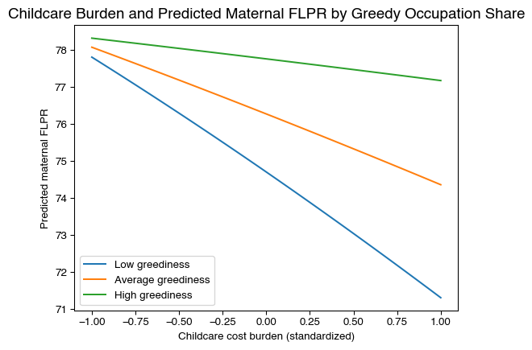

## Introduction {#sec-1}
Earlier this year, I examined the major factors that help explain U.S. maternal labor force participation trends and persistent wage differentials between men and women. Existing research consistently identifies motherhood as an important contributor to both reduced labor-force participation and long-term earnings penalties.

Childcare costs, which have significantly outpaced overall inflation, play a significant role in women’s ability or decision to remain in the workforce. This trend has driven an overall focus within the research community on the relationship between childcare affordability and maternal labor force participation. Research has appropriately paid particular attention to low-income women, for whom childcare expenses represent a large share of potential earnings, and whose labor market attachment is the most impacted by childcare costs (@havnes_no_2011). 

Several studies have concluded that reducing childcare costs would increase maternal employment, especially among low-income women. The majority of U.S. childcare assistance programs are also primarily available for lower-income households and reach only a minority of eligible families. Less is known about this association amongst women in moderate or high income brackets, who remain burdened by high childcare costs. For these women, childcare constraints may impact labor force participation differently. Increased earning potential and financial resources may make them more likely to remain employed despite high childcare costs, while reducing hours or seeking work flexibility to meet childcare demands. This behavior may ultimately result in reduced career advancement and lower wages. 

This paper tests this theory, using county-level data to analyze how women in different occupational contexts may respond differently to childcare costs. I use the concentration of women working in “greedy” occupations, or high-paying occupations that disproportionately reward long hours and constant availability, to measure local occupational context. This is used to test whether the known association between childcare burden and maternal labor-force participation is moderated by occupation “greediness”.

County-level female labor force participation only determines whether mothers participate in the labor force, rather than how many hours they work. Therefore, this analysis does not directly model the wage gap. However, beginning to understand potential effect heterogeneity in this relationship may help explain persistent gender gaps in earnings despite comparable levels of overall labor-force participation.

## Background and Conceptual Framework

### Existing Childcare Policy and Maternal Employment
Researchers generally agree that increased investment in childcare affordability interventions results in higher maternal labor force participation, particularly among low-income women in the first few years after birth. For instance, Burgess, Chien and Enchautegui find that increasing Child Care and Development Block Grant (CCDBG) expenditures by 10-percent per child would increase employment levels among low-income women with young children by between half to two-thirds of a percent (@noauthor_effects_2016).

Still, the majority of U.S. childcare assistance programs reach only a subset of families and are concentrated among lower-income households. The Child Care and Development Block Grant (CCDBG) is only available for families who make less than 85% of their state median income. Even amongst those that meet requirements, federal childcare subsidies only reach approximately 14% of eligible families (@noauthor_factsheet_2020), and state subsidies reach only approximately 22% of eligible families. Tax incentives, including the Child and Dependent Care Tax Credit, also benefit a minority of families with children due to its non-refundable structure, steep income phase-downs, and restrictions that require two working parents. (@araujo_impact_2025)

While most childcare programs focus on low-income families, evidence from universal early childcare programs suggests that reducing childcare constraints can affect maternal employment across a broader range of women. Two years after implementing a universal pre-kindergarten program in 2008, D.C. observed a 12% increase in the maternal labor force participation rate. A study from the Center for American Progress found that this increase was strongly associated with implementation of universal preschool (@rasheed_effects_2018). This example is particularly important given D.C.’s occupational profile, with an unusually large concentration of highly-educated women in high-paying, senior positions. This example motivates the current analysis, which seeks to understand the varying slope of the relationship between childcare affordability and labor force participation among counties with different female occupational profiles.

### Occupational “Greediness”
This analysis builds on existing research from economist Claudia Goldin, who has extensively studied “greedy occupations”. Goldin finds that greedy occupations lead women to remain employed, even as they have children, but earn less over time, due to childcare responsibilities that prevent them from meeting demanding work requirements, including long hours and travel (@goldin_grand_2014). Women’s role as primary care-givers leads them to take career breaks, reduce hours, and trade high-stress roles for flexible roles. 

Goldin identifies finance, law, consulting, and corporate management as common greedy occupations, characterized by time inflexibility, low work substitutability, and non-linear pay. These occupations drive gender pay differentials, since women are more likely to experience childcare related work interruptions and less likely to be able to work rigid schedules (@sobeck_greedy_2024). Using Goldin’s research as a framework, I model county-level occupational greediness by sex using U.S. Census adult employment statistics. 

### Educational Attainment
Educational attainment is closely related to occupation context and labor force participation. Geographies with a greater share of individuals with advanced degrees are more likely to have higher concentrations of individuals in advanced white-collar occupations. Women in these occupations are more likely to have greater earning power, which also influences their labor force attachment. I model educational attainment as the share of individuals in each county with at least a bachelor’s degree. This is used to determine if the effect of greedy occupation structure is partially or completely explained by county educational composition.

### Geographic “Rootedness” and Informal Childcare Support
Informal childcare support, through family-members, friends and neighbors, can provide mothers with relief from exorbitant childcare costs, as well as unmatched flexibility. However, the availability of local support varies across households. Highly-educated and high-income individuals are often more likely to move away from their birthplace, where family resides, to regions with greater economic opportunities for higher-paying jobs. While over half of U.S. adults report living within an hour of family, a Pew Research study found that upper-income adults and adults with a postgraduate degree were the most likely to report living near no extended family (@hurst_more_2022).

Existing literature suggests that access to informal familial childcare can influence maternal labor force participation. Compton and Pollak find that married women with young children that live within close proximity of mothers or mothers-in-law are predicted to have a 4 to 10 percent higher labor force participation rate when compared to women that live farther from family (@compton_family_2014). They theorize that family members within close proximity provide “insurance” to working mothers, by being available to provide care in irregular or unanticipated circumstances. Building upon this framework, I use geographic rootedness as a proxy for access to local familial childcare. I model geographic “rootedness” as the share of adults 25 or older in each county who report living in the state they were born in. While this does not directly estimate the proximity of family or availability of informal childcare, it provides a county-level profile of geographic attachment to measure potential differences in access to informal childcare support.

## Data and Measures
### Data Sources
This analysis uses 2022 data from the Department of Labor’s National Database of Childcare Prices (NDCP) to retrieve each county’s maternal female labor force participation rate (FLPR) for women with children under 6, the outcome variable, and childcare costs, which are used to determine the childcare cost burden. The American Community Survey (ACS) five-year estimates are used to identify the median family income, share of bachelor’s-plus individuals, female greedy occupation share, and geographic rootedness. This county level data is merged using FIPS-codes, resulting in a final sample of 2,653 counties. 491 counties are excluded from the sample as a result of missing any of the modeled variables. Exclusion is primarily a result of missing childcare data, including complete state absences in Pennsylvania, Indiana, Vermont, and New Mexico, due to low response rates or too few childcare providers. This is a known limitation of the NDCP. 

### Data Transformations
FLPR is first converted from a percentage to a proportion. Exact 0 and 1 FLPR values are then slightly adjusted, since the logit function is undefined at those exact values. Greedy occupation share is represented by the proportion of eligible employed women working in greedy occupations. Bachelor’s-plus share is calculated as the proportion of adults age 25 and older with at least a bachelor’s degree. Finally, geographic rootedness is calculated as the proportion of adults age 25 and older who were born in their current state of residence. All continuous predictors are standardized to have mean zero and standard deviation prior to modeling. 

### Data and Measures Summary

The sources and representations of each variable are summarized below:

::: {#tbl-0}
| Variable | Source(s) | Representation |
|---|---|---|
| Maternal Female Labor Force Participation Rate (FLPR) | Department of Labor (DOL) county data | Labor-force participation rate among women with children under age six |
| Childcare cost burden | DOL National Database of Childcare Prices; American Community Survey (ACS) median family income | Annual center-based childcare cost for children ages 0–5 divided by median family income |
| Greedy occupation share | ACS Occupation by Sex for the Civilian Employed Population 16 Years and Over (Series S240) | Share of employed women in management, business and financial, and legal occupations |
| Educational attainment | ACS Place of Birth by Educational Attainment in the United States (Series B06009) | Share of adults age 25 or older with a bachelor’s, graduate, or professional degree |
| Geographic rootedness | ACS Place of Birth by Educational Attainment in the United States (Series B06009) | Share of adults age 25 or older who were born in their current state of residence |

: Data Sources and Variable Representations
:::

## Empirical Strategy
### Naive Model: FLPR as a Function of Childcare Burden
First, I analyze a naive logit-Normal regression model of female labor force participation as a function of only childcare burden.

This relationship can be written as:
$$
y_i = \beta_0 + \beta_{C}c_i
$$ {#eq-1}

where $i$ indexes counties, $y_i$ is the female labor force participation rate, $\beta_0$ represents the baseline female labor force participation rate when childcare burden is held constant, or at an average childcare burden across counties, and $\beta_C$ represents the strength of the relationship between childcare cost burden and female labor force participation.

County-level FLPR resembles a normal distribution, therefore, FLPR is modeled using a normal likelihood. The intercept term, or baseline female labor force participation rate, is drawn from a normal distribution with a prior mean of 0.847, or logit(0.70), with $\sigma=.25$ to allow for some uncertainty. This rate is close to the empirical FLPR mean of 70% across counties. Childcare burden is modeled with a weakly informative prior of $\mu=0, \sigma=0.15$, assuming no direction of relationship, but expecting few extreme values.

Figure 1 shows a Bayesian probabilistic graphical model (PGM) depicting the Naive model.

### Adjusting for Covariates
Next, I fit progressively more complex models, adding relevant covariates and comparing coefficient estimates. All models are estimated using Bayesian logit-Normal regression. This approach allows me to assess robustness of the estimated relationships after adjusting for educational attainment and geographic rootedness and whether these variables account for part of the association attributed to greedy occupational structure. Like childcare burden, all covariates are modeled with weakly informative priors of $\mu=0, \sigma=0.15$.

### Hypotheses
My predictions about the relationships between county-level childcare cost burden, greedy occupation share, educational attainment, and geographic rootedness yield the following hypotheses:

* **Hypothesis 1.** $\beta_{C} < 0$ (*hypothesized causal mechanism*: higher childcare cost burden is associated with lower county-level maternal labor-force participation).
* **Hypothesis 2.** $\beta_{CG} > 0$ (*hypothesized causal mechanism*: the negative association between childcare burden and maternal labor-force participation weakens as greedy occupation share increases).
* **Hypothesis 3.** $\beta_{B} > 0$ (*hypothesized causal mechanism*: inclusion of educational attainment reduces the estimated coefficient of greedy occupation share, indicating that educational composition accounts for part of the initially observed association).
* **Hypothesis 4.** $\beta_{R} > 0$ (*hypothesized causal mechanism*: county-level geographic rootedness is associated with higher maternal labor-force participation, potentially because rootedness is associated with stronger access to informal family support networks).

### “Greedy” Model
The next model, the “greedy” model, introduces county occupation greediness and its interaction with childcare burden. 

This relationship can be written as:

$$
yi = \beta_0 + \beta_{C}ci + \beta_{G}gi + \beta_{CG}cgi
$$

where $\beta_G$ represents the association between greedy occupation share and maternal FLPR while holding childcare burden constant, and $\beta_{CG}$ represents an interaction between childcare burden and greedy occupation share. $\beta_{CG}$ is used to measure whether the relationship between childcare burden and FLPR varies across occupational contexts. 

To ease interpretation of $\beta_{CG}$, I later estimate the change in predicted FLPR associated with moving from average childcare burden to one standard deviation above average at low, average, and high levels of greedy occupation share.

### Education-Adjusted Model
The education-adjusted model introduces the share of county residents with a bachelor’s degree or greater advanced degree. 

This relationship can be written as:

$$
yi = \beta_0 + \beta_{C}ci + \beta_{G}gi + \beta_{CG}cgi + \beta_{B}bi
$$

where $\beta_{B}$ represents the association between educational attainment and maternal FLPR while holding other variables constant. This is used to test whether occupation context is partially or completely explained by education attainment. The greedy-occupation coefficient across Models 2 and 3 are thus compared to assess changes in direction or magnitude after education is included.

### Fully Adjusted “Rooted” Model
The final fully adjusted model, or “rooted” model, introduces geographical rootedness, measured as the share of adults age 25 and older who were born in their current state of residence.

This relationship can be written as:

$$
yi = \beta_0 + \beta_{C}ci + \beta_{G}gi + \beta_{CG}cgi + \beta_{B}bi + \beta_{R}ri
$$

where $\beta_{R}$ represents the association between geographical rootness and maternal FLPR while holding other variables constant. Rootedness is included as a proxy for access to informal familial childcare and used to test whether differing geographic attachment profiles between counties are partially responsible for the other estimated relationships.

## Results {#sec-4}

### Poseterior Estimates
The following table shows posterior estimates for each model specification. Within each cell, the first value is the posterior mean, and the second is the 89% credible interval, shown within brackets. All values are shown on the logit scale.

::: {#tbl-1} 
| Parameter | Naive | Greedy | + Education | + Rootedness |
|:---|---:|---:|---:|---:|
| $\beta_{0}$ (Intercept) | 1.172 [1.10, 1.20] | 1.167 [1.10, 1.20] | 1.167 [1.10, 1.20] | 1.168 [1.10, 1.20] |
| $\beta_{c}$ (Childcare burden) | -0.107 [-0.160, -0.058] | -0.120 [-0.170, -0.070] | -0.122 [-0.170, -0.076] | -0.103 [-0.150, -0.052] |
| $\beta_{G}$ (Greedy occupation share) | — | 0.112 [0.064, 0.160] | 0.067 [0.010, 0.130] | 0.085 [0.026, 0.140] |
|$\beta_{CG}$ (Childcare burden × greedy share) | — | 0.072 [0.026, 0.120] | 0.069 [0.022, 0.120] | 0.070 [0.023, 0.110] |
| $\beta_{B}$ (Bachelor's-plus attainment) | — | — | 0.084 [0.024, 0.140] | 0.155 [0.092, 0.220] |
| $\beta_{R}$ (Born-in-state share) | — | — | — | 0.173 [0.120, 0.230] |

: Posterior estimates of model specifications
::: 

$\beta_{C}$, representing the childcare burden estimate, remains relatively stable across models. Notably, the interaction term, $\beta_{CG}$, is very stable, which suggests that inclusion of educational attainment and geographic rootedness does not eliminate heterogeneity. Inclusion of educational attainment significantly reduces the strength of $\beta_{G}$, greedy occupation share, from 0.112 to 0.067. This suggests that differences in educational attainment between counties account for a large part of the earlier observed association between occupational greediness and FLPR. However, once geographical rootedness, $\beta_{R}$, is included, occupational greediness’s coefficient increases to 0.085. This suggests that the relationships among these three variables are partially overlapping.

### Heterogeneity in the Estimated Association between Childcare Burden and FLPR

Using the fully adjusted model, we now examine the predicted FLPR associated with moving from average childcare burden to one standard deviation above average at low, average, and high levels of greedy occupation share. The following table and figure show clearly different slopes of the relationship between childcare burden and FLPR across occupational contexts. 

::: {#tbl-2}
| Occupational Profile | Mean change in FLPR | SD | 89% credible interval |
|:---|---:|---:|---:|
| Low greedy (-1 SD) | -3.40 | 0.92 | [-4.90, -1.90] |
| Average greedy (0 SD) | -1.91 | 0.60 | [-2.90, -0.96] |
| High greedy (+1 SD) | -0.59 | 0.72 | [-1.70, 0.55] |

: Posterior estimated change in maternal FLPR associated with an increase in childcare burden from the sample mean to one SD above the mean, evaluated at low, average, and high levels of occupational greediness.
:::

Aligning with existing research, counties with low levels of occupational greediness, shown by the blue line, show the steepest slope. This suggests that maternal FLPR is the most sensitive to childcare cost burden in these counties. Notably, the strength of the association begins to weaken when analyzing counties with average ocucpational greediness, shown in orange, and appears nearly flat when analyzing counties with high occupational greediness, shown in green.

## Discussion
These results align with existing research, suggesting that higher childcare burden is associated with lower maternal labor force participation. They also expand existing analysis of the naive association between childcare cost burden and maternal FLPR by showing that this relationship varies across county occupational contexts. The well-established negative association between childcare burden and maternal FLPR is highest amongst counties with a relatively low share of women in greedy occupations and weakens significantly as greedy occupation share increases.

This observed occupational hetereogenity aligns with the intuition that women in communities with high concentrations of high-earning, prestigious professions may be less likely to leave the labor force when responding to increases in childcare costs. However, because this model uses county-level estimates, it should not be interpreted to mean that individual women employed in greedy occupations are responsible for this effect heterogenity.

Including bachelor's plus share weakens the observed association between occupational greediness and maternal FLPR, indicating that county level differences in educational attainment partially account for this association. However, it notably does not reduce the effect of the interaction between childcare burden and occupation greediness. The model results also showed a positive association between Geographic rootedness and maternal FLPR. Interestingly, the strength of this association was even larger than educational attainment, a well-known factor strongly associated with FLPR. If geographic rootedness provides a fair proxy of familial childcare availability, this suggests that access to such support reduces childare constraints, allowing mothers to remain in the workforce. However, it is important to note that while the estimated associations between variables remain relatively consistent across models, each model only explains a small amount of variation in maternal FLPR between counties. 

## Conclusions
This paper strengthens existing research by affirming that childcare burden is negatively associated with female labor force participation. It builds upon the current body of knowledge by uncovering that this association is partially moderated by local occupational contexts. Results also indicate that acces to familial support networks may also shape the slope of the relationship between female labor force participation and childcare costs. It also highlights a need for additional research, as both the naive model of maternal FLPR as a function solely of childcare and the fully adjusted model explain only a small amount of variation in maternal FLPR between counties. Ultimatley, this analysis offerse important context to researchers and policy-makers, by providing insight into why estimated employment responses to childcare affordability interventions vary. 

## References

::: {#refs}
:::
